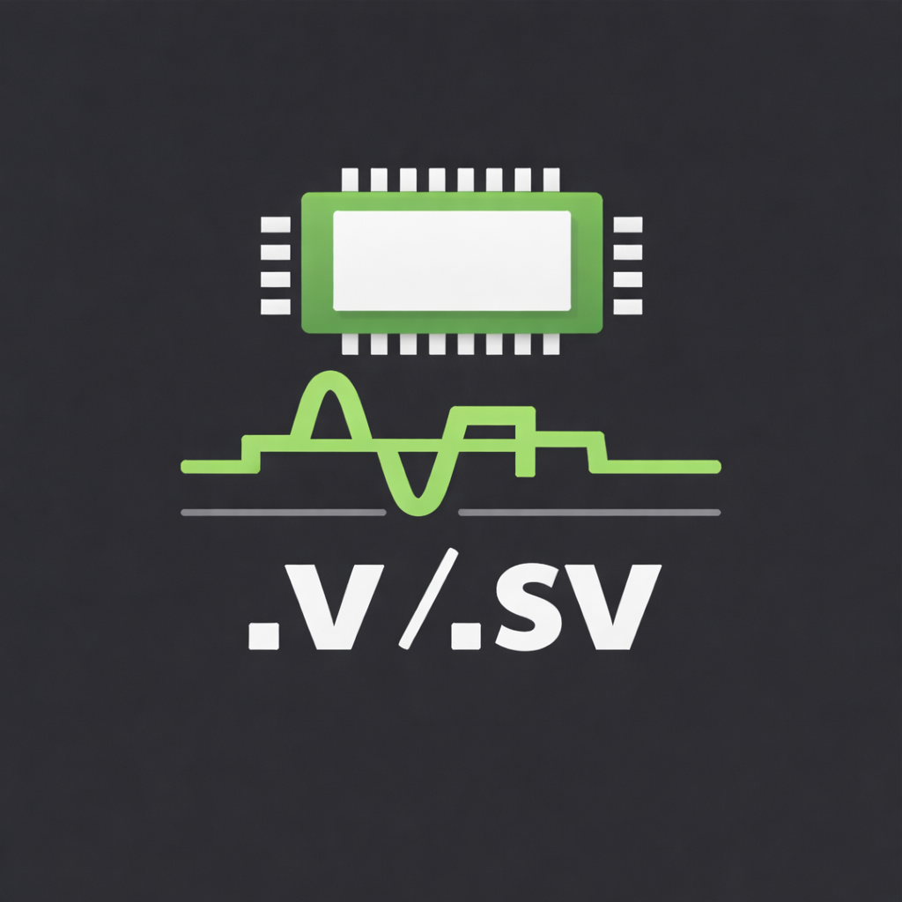

# HDL support for VS Code 

HDL support for VS Code with Syntax Highlighting, Snippets, Linting, Formatting and much more!

[](https://marketplace.visualstudio.com/items?itemName=mshr-h.VerilogHDL)
[](https://marketplace.visualstudio.com/items?itemName=mshr-h.VerilogHDL)
[Ask DeepWiki](https://deepwiki.com/mshr-h/vscode-verilog-hdl-support)


## Installation

Install it from [VS Code Marketplace](https://marketplace.visualstudio.com/items/mshr-h.VerilogHDL) or [Open VSX Registry](https://open-vsx.org/extension/mshr-h/veriloghdl).

## Features

- Syntax Highlighting
  - Verilog-HDL
  - SystemVerilog
  - Bluespec SystemVerilog
  - VHDL
  - Verilog-AMS
  - Vivado UCF constraints
  - Synopsys Design Constraints
  - Verilog Filelists (dot-F files)
  - Tcl
- \[Experimental\]Integrated VCD viewer powered by [fliplot](https://github.com/raczben/fliplot)
- Simple Snippets
- Linting support from:
  - Icarus Verilog - `iverilog`
  - Modelsim - `modelsim`
  - Verilator - `verilator`
  - Vivado Logical Simulation - `xvlog`
  - Slang - `slang`
  - Verible Verilog Lint - `verible-verilog-lint`
- Linting support
  - Bluespec SystemVerilog
- Ctags Integration
  - Autocomplete
  - Document Symbols Outline
  - Hover over variable declaration
  - Go to Definition & Peek Definition
  - Module Instantiation
- Language Server support from:
  - [svls](https://github.com/dalance/svls)
  - [veridian](https://github.com/vivekmalneedi/veridian)
  - [HDL Checker](https://github.com/suoto/hdl_checker)
  - [verible-verilog-ls](https://github.com/chipsalliance/verible)
  - [vhdl_ls](https://github.com/VHDL-LS/rust_hdl)
  - [tclsp](https://github.com/nmoroze/tclint)
- Formatting support from:
  - [verilog-format](https://github.com/ericsonj/verilog-format)
  - [istyle-verilog-formatter](https://github.com/thomasrussellmurphy/istyle-verilog-formatter)
  - [verible-verilog-format](https://github.com/chipsalliance/verible)

## Usage Instructions

- All linters expect the executable binary ( `iverilog` , `verilator` ...) to be present in the `PATH` environment variable, unless otherwise specified.
- While using `` `include`` directives, the path to the files should be relative to the workspace directory, unless`runAtFileLocation` is enabled (not supported by all linters)

### Ctags Integration

This extension uses the tags created using Ctags to provide many of its features. It is recommended to use [Universal Ctags](https://github.com/universal-ctags/ctags) as it supports SystemVerilog also, compared to Exuberant Ctags and other older versions. The tags are stored in memory and not as separate files.

Currently the integrated feature supports only tags in the currently opened file, not tags in other files.
Enable this integration with the `verilog.ctags.enabled` setting.
However, you can use other independent Ctags extensions to find definitions from any file.

For example [Ctags Companion](https://github.com/gediminasz/ctags-companion) works well with this extension
by adding the following settings on `.vscode/settings.json` in your workspace.

```json
{
    "ctags-companion.command": "ctags -R --fields=+nKz --langmap=SystemVerilog:+.v -R rtl /opt/uvm-1.2/src",
}
```

It searches for definitions not only in the workspace, but also in files outside the workspace (ex. `/opt/uvm-1.2/src` in the example above).
It also supports the `readtags` command included in Universal Ctags, allowing for fast searches from large workspaces.

#### Installation of Universal Ctags

- Windows - Daily builds are available at [ctags-win32](https://github.com/universal-ctags/ctags-win32)
- Linux - Installation instructions are [here](https://github.com/universal-ctags/ctags/blob/master/docs/autotools.rst)
- macOS - Install through Homebrew from [here](https://github.com/universal-ctags/homebrew-universal-ctags)

Add the installation path of Ctags binary in your `PATH` environment variable or mention it in `verilog.ctags.path` setting.

### Commands

- **Rerun lint tool**

    Choose a lint tool from the list and run it manually. Useful if the code was changed by an external script or version control system.

- **Instantiate Module**

    Choose a module present in your workspace to instantiate it in the current file.

- **Open Fliplot Waveform Viewer**

    Open the embedded Fliplot waveform viewer and load a VCD file.

### Language Servers (Experimental)

We currently support the following Language Servers and enabled for Verilog-HDL, SystemVerilog and VHDL.
You can enable multiple Language Servers at the same time.
It might be pretty unstable because it's currently in the experimental support.
If you encounter any problems even if it's not related to this feature, **deleting all the config may solve the problem**.

| Language Server                                                | Verilog-HDL   | SystemVerilog | VHDL          |
| -------------------------------------------------------------- | :-----------: | :-----------: | :-----------: |
| [svls](https://github.com/dalance/svls)                        | not supported | enabled       | not supported |
| [veridian](https://github.com/vivekmalneedi/veridian)          | not supported | enabled       | not supported |
| [HDL Checker](https://github.com/suoto/hdl_checker)            | enabled       | enabled       | enabled       |
| [verible-verilog-ls](https://github.com/chipsalliance/verible) | enabled       | enabled       | not supported |
| [vhdl_ls](https://github.com/VHDL-LS/rust_hdl)                 | not supported | not supported | enabled       |

Install [svls](https://github.com/dalance/svls) via `cargo`:

```sh
cargo install svls
```

Install [vhdl_ls](https://github.com/VHDL-LS/rust_hdl) via `cargo`:

```sh
cargo install vhdl_ls
```

Tcl support is provided by [tclsp](https://github.com/nmoroze/tclint) for Tcl/SDC/XDC/UPF files. Configure it under `verilog.languageServer.tclsp` and install `tclint` (provides the `tclsp` binary). Recommended install via `uv`:

```sh
uv tool install tclint
```

### Formatting (Experimental)

We currently support Verilog-HDL file formatting with the following formatters.

- [verilog-format](https://github.com/ericsonj/verilog-format)
- [thomasrussellmurphy/istyle-verilog-formatter](https://github.com/thomasrussellmurphy/istyle-verilog-formatter).
- [verible-verilog-format](https://github.com/chipsalliance/verible)

You can format the Verilog-HDL file by typing `Ctrl-Shift-p`, then select `Format Document`.
Entire file formatting is supported. Selected range formatting is not supported yet.
All the settings for formatting is under `verilog.formatting` namespace.

## [Guidelines for Contributing](./CONTRIBUTING.md)

## Extension Development

### Launch in Debug Mode

1. Install dependencies with `npm install`.
2. Open the repository in VS Code and start the default build task (`watch`) or simply press `F5`—the `Launch Extension` configuration in [.vscode/launch.json](.vscode/launch.json) will run the build task automatically.
3. In the Run and Debug view, pick **Launch Extension** and start debugging. VS Code will open an Extension Development Host pointing at the bundled `language_examples` workspace so you can try the features immediately.
4. Set breakpoints in the `src` files; the compiled output in `out` is mapped via sourcemaps so the breakpoints hit your TypeScript sources.

### Logs

Logs are outputted to LogOutputChannel in th VS Code.
You can check it by opening the **Output** pane in VS Code and choose _Verilog_ in the drop-down menu.

## Helpful links

- [Verilog in VSCode With Linting (Using Modelsim) - YouTube](https://www.youtube.com/watch?v=-DTGf3Z6v_o)
- [A Productive VSCode Setup for SystemVerilog Development - Igor Freire](https://igorfreire.com.br/2023/06/18/vscode-setup-for-systemverilog-development/)

## Thanks

- To all our [Contributors](https://github.com/mshr-h/vscode-verilog-hdl-support/graphs/contributors)
- [Textmate Package for Verilog](https://github.com/textmate/verilog.tmbundle)
- [SublimeLinter-contrib-iverilog](https://github.com/jfcherng/SublimeLinter-contrib-iverilog)
- [SublimeLinter-contrib-vlog](https://github.com/dave2pi/SublimeLinter-contrib-vlog)
- [Sublime Text Bluespec SystemVerilog](https://github.com/thotypous/sublime-bsv)
- [yangsu/sublime-vhdl](https://github.com/yangsu/sublime-vhdl)
- [Sublime EDA](https://github.com/tschinz/sublime_eda)
- [dalance/svls](https://github.com/dalance/svls)
- [vivekmalneedi/veridian](https://github.com/vivekmalneedi/veridian)
- [suoto/hdl_checkerChecker](https://github.com/suoto/hdl_checker)
- [chipsalliance/verible](https://github.com/chipsalliance/verible)
- [ericsonj/verilog-format](https://github.com/ericsonj/verilog-format)
- [thomasrussellmurphy/istyle-verilog-formatter](https://github.com/thomasrussellmurphy/istyle-verilog-formatter)
- [slang C++ docs](https://sv-lang.com/)
- [Digital-EDA/Digital-IDE: All in one vscode plugin for HDL development](https://github.com/Digital-EDA/Digital-IDE)
  - `configs/tcl.configuration.json` and `syntaxes/tcl.tmlanguage.json` are obtained from the repo.
- [eirikpre/VSCode-SystemVerilog: SystemVerilog support in VS Code](https://github.com/eirikpre/VSCode-SystemVerilog)
  - SystemVerilog syntax is obtained from the repo.
- [raczben/fliplot: HTML & Js based VCD viewer](https://github.com/raczben/fliplot)
- [wavedrom/vcd-samples: sample VCD files](https://github.com/wavedrom/vcd-samples)

## Star History

[](https://star-history.com/#mshr-h/vscode-verilog-hdl-support&Date)
