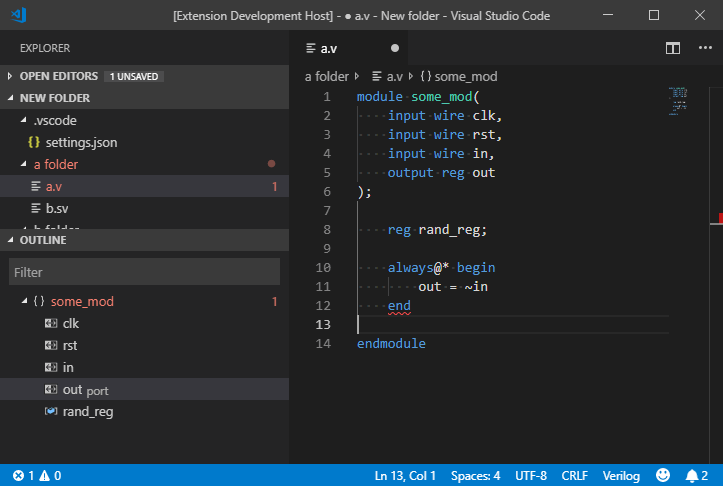

# Verilog-HDL/SystemVerilog/Bluespec SystemVerilog support for VS Code

Verilog-HDL, SystemVerilog and Bluespec SystemVerilog support for VS Code with Syntax Highlighting, Snippets, Linting and much more!

## Installation

Install it from [VS Code Marketplace](https://marketplace.visualstudio.com/items/mshr-h.VerilogHDL)

## Features

### Done

- Syntax Highlighting
  - Verilog-HDL
  - SystemVerilog
  - Bluespec SystemVerilog
  - Vivado UCF constraints
  - Synopsys Design Constraints
- Simple Snippets
- Linting support from:
  - Icarus Verilog - `iverilog`
  - Vivado Logical Simulation - `xvlog`
  - Modelsim - `modelsim`
  - Verilator - `verilator`
- Linting support
  - Bluespec SystemVerilog
- Ctags Integration
  - Autocomplete
  - Document Symbols Outline
  - Hover over variable declaration
  - Go to Definition & Peek Definition
  - Module Instantiation

### In Progress / Future

- Language Server support
  - Currently only supports [svls](https://github.com/dalance/svls)
- Improvements in the newly added features

[Take a look at our list of planned features](https://github.com/mshr-h/vscode-verilog-hdl-support/issues/25)

### Ctags Integration

This extension uses the tags created using Ctags to provide many of its features. It is recommended to use [Universal Ctags](https://github.com/universal-ctags/ctags) as it supports SystemVerilog also, compared to Exuberant Ctags and other older versions. The tags are stored in memory and not as separate files.

### Installation of Universal Ctags

- Windows - Daily builds are available at [ctags-win32](https://github.com/universal-ctags/ctags-win32)
- Linux - Installation instructions are [here](https://github.com/universal-ctags/ctags/blob/master/docs/autotools.rst)
- macOS - Install through Homebrew from [here](https://github.com/universal-ctags/homebrew-universal-ctags)

Add the installation path of Ctags binary in your `PATH` environment variable or mention it in `verilog.ctags.path` setting.

## Configuration Settings

Use the following settings to configure the extension to your needs

- `verilog.linting.linter` (Default: `none` )

  Choose the linter for you. Possible values are

  - `iverilog`
  - `xvlog`
  - `modelsim`
  - `verilator`
  - `none`

- `verilog.linting.iverilog.arguments` (Default: nothing)

  Add custom arguments to Icarus Verilog for linting, like `-Wall` . The argument `-t null` will be added by the linter automatically.

- `verilog.linting.iverilog.runAtFileLocation` (Default: `false` )

  By default, the linter will be run at the workspace directory. Enable this option to run at the file location. If enabled, `` `include`` directives should contain file paths relative to the current file.

- `verilog.linting.modelsim.arguments` (Default: nothing)

  Add custom arguments to Modelsim for linting.

- `verilog.linting.modelsim.work` (Default: nothing)

  Add custom work library to Modelsim for linting.

- `verilog.linting.verilator.arguments` (Default: nothing)

  Add custom arguments to Verilator for linting, like `-Wall` . The argument `--lint-only -I<document folder>` will be added by the linter automatically.

- `verilog.linting.verilator.runAtFileLocation` (Default: `false` )

  By default, the linter will be run at the workspace directory. Enable this option to run at the file location. If enabled, `` `include`` directives should contain file paths relative to the current file.

- `verilog.linting.verilator.useWSL` (Default: `false` )

  Run verilator under WSL (use `apg-get install verilator` to install). Paths generated automatically by the
  extension (the path to the Verilog file as well as the auto-generated document folder for `-I` ) are translated
  to WSL paths using the `wslpath` program. Any other paths you specify in `verilog.linting.verilator.arguments`
  must be manually converted.

- `verilog.ctags.path` (Default: `ctags` )

  Path to your installation of Ctags if it isn't already present in your `PATH` environment variable.

- `verilog.languageServer` (Default: `none` )

  Select the Language Server. Currently supports [svls](https://github.com/dalance/svls) .
  Make sure `svls` is in your`$PATH` environmental variable.
  Experimental support.

- `verilog.logging.enabled` (Default: `false` )

  Enable logging for this extension. Open the **Output** pane in VS Code and choose _Verilog_ in the drop-down menu to view the log.

## Commands

- **Rerun lint tool**

  Choose a lint tool from the list and run it manually. Useful if the code was changed by an external script or version control system.

- **Instantiate Module**

  Choose a module present in your workspace to instantiate it in the current file.

## Usage Instructions

- All linters expect the executable binary ( `iverilog` , `verilator` ...) to be present in the `PATH` environment variable, unless otherwise specified.
- While using `` `include`` directives, the path to the files should be relative to the workspace directory, unless` runAtFileLocation` is enabled (not supported by all linters)

## Compatability

| Feature                           |  Windows   |    Linux     |    MacOS    |
| --------------------------------- | :--------: | :----------: | :---------: |
| Basics (like Syntax highlighting) | Windows 10 | Ubuntu 20.04 | macOS 10.15 |
| Icarus Verilog                    | Windows 10 | Ubuntu 18.04 |     Yes     |
| Vivado Logical Simulation         | Windows 10 |  Not Tested  | Not Tested  |
| Modelsim                          | Windows 10 | Ubuntu 18.04 | Not Tested  |
| Verilator                         | Windows 10 |   Debian 9   | Not Tested  |
| Ctags Integration                 | Windows 10 | Ubuntu 18.10 | Not Tested  |
| Language Server                   | Windows 10 | Ubuntu 20.04 | macOS 10.15 |

If you have tested the linters in new platforms or have issues with them, feel free to file an issue.

## [Guidelines for Contributing](./CONTRIBUTING.md)

## Thanks

- To all our [Contributors](https://github.com/mshr-h/vscode-verilog-hdl-support/graphs/contributors)
- [Textmate Package for Verilog](https://github.com/textmate/verilog.tmbundle)
- [SublimeLinter-contrib-iverilog](https://github.com/jfcherng/SublimeLinter-contrib-iverilog)
- [SublimeLinter-contrib-vlog](https://github.com/dave2pi/SublimeLinter-contrib-vlog)
- [Sublime Text Bluespec SystemVerilog](https://github.com/thotypous/sublime-bsv)
- [svls](https://github.com/dalance/svls)
- [Sublime EDA](https://github.com/tschinz/sublime_eda)
