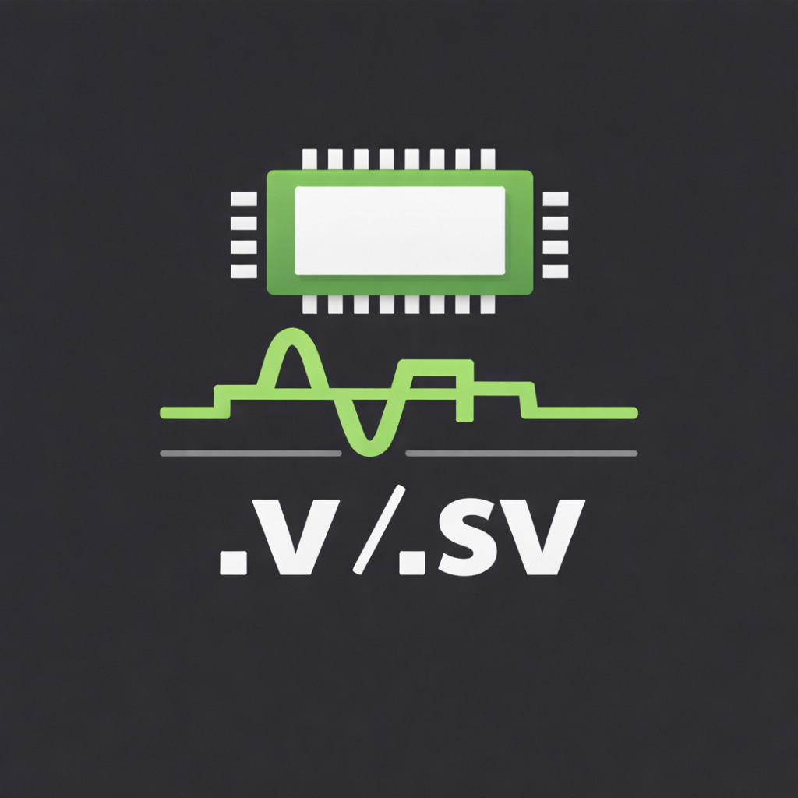
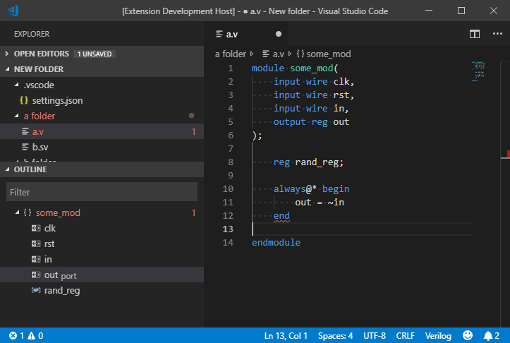

# HDL support for VS Code 

HDL support for VS Code with syntax highlighting, snippets, linting, formatting, project-aware navigation, waveform viewing, and language-server integration.

[](https://www.bestpractices.dev/projects/10949)
[Ask DeepWiki](https://deepwiki.com/mshr-h/vscode-verilog-hdl-support)



## Installation

Install it from [VS Code Marketplace](https://marketplace.visualstudio.com/items?itemName=mshr-h.VerilogHDL) or [Open VSX Registry](https://open-vsx.org/extension/mshr-h/veriloghdl).

## Quick Start

Syntax highlighting, snippets, basic editor integration, and waveform opening work immediately after installation.

Linting is disabled by default. Pick a linter after installing the external tool:

```json
{
    "verilog.linting.linter": "verilator"
}
```

Project-aware Verilog/SystemVerilog features are also disabled by default. Enable them when you want cross-file HDL intelligence, preferably with explicit filelists in large workspaces:

```json
{
    "verilog.project.enabled": true,
    "verilog.project.filelists": ["rtl/files.f"],
    "verilog.project.includeDirs": ["rtl/include"],
    "verilog.project.defines": {
        "SIMULATION": true,
        "DATA_WIDTH": 32
    },
    "verilog.project.topModules": ["top"]
}
```

Use **Verilog: Doctor** from the command palette to inspect external tool paths, enabled language servers, formatter setup, linter configuration, WSL setup, include paths, and project configuration.

To try the project-aware features together, open the [HDL Feature Showcase](examples/hdl-feature-showcase/README.md). It walks through project-aware navigation, HDL Explorer hierarchy, semantic diagnostics, compile-unit linting, and inactive preprocessor regions with a small multi-target SystemVerilog project.

## Features

- Syntax highlighting and language modes for HDL, constraint, script, filelist, and waveform files.
- Inactive Verilog/SystemVerilog preprocessor region highlighting.
- VCD waveform viewer integration with embedded [Fliplot](https://github.com/raczben/fliplot) and optional [Vaporview](https://marketplace.visualstudio.com/items?itemName=lramseyer.vaporview).
- Project-aware Verilog/SystemVerilog model from filelists, project settings, or workspace discovery.
- HDL Explorer with project summaries, compile units, include directories, defines, indexed modules/packages, and best-effort hierarchy.
- Lightweight semantic diagnostics for unresolved modules/includes, unknown named ports/parameters, and optional unresolved macros.
- Linting support for Icarus Verilog, ModelSim, Verilator, Vivado `xvlog`, Slang, and Verible Verilog Lint.
- Optional compile-unit linting for Slang, Verilator, and Icarus Verilog.
- Formatting support from `verilog-format`, `iStyle`, and `verible-verilog-format`.
- Project-aware HDL editing: go-to-definition, Find References, Rename Symbol, hover, workspace symbols, completion, module instantiation, and code actions.
- Ctags-backed fallback features for autocomplete, document symbols, hover, go-to-definition, peek definition, and module instantiation.
- Optional language-server integration for Verilog/SystemVerilog, VHDL, Tcl, SDC, XDC, and UPF.

## Supported Languages and File Types

| Language / file type | Extensions / usage | Notes |
| --- | --- | --- |
| Verilog-HDL | `.v`, `.vh`, `.vl` | Syntax highlighting, snippets, formatting, linting, Ctags fallback, and optional project-aware features |
| SystemVerilog | `.sv`, `.svh`, `.SV` | Syntax highlighting, snippets, formatting, linting, Ctags fallback, and optional project-aware features |
| Verilog-AMS | `.vams`, `.va` | Syntax highlighting and Verilog snippets |
| VHDL | `.vhd`, `.vhdl`, `.vho` | Syntax highlighting and optional language-server support |
| UCF constraints | `.ucf` | Syntax highlighting |
| SDC constraints | `.sdc` | Syntax highlighting and optional `tclsp` support |
| XDC constraints | `.xdc` | Syntax highlighting and optional `tclsp` support |
| Tcl | `.tcl`, `.tm`, `.tk` | Syntax highlighting and optional `tclsp` support |
| UPF | `.upf` | Tcl-based syntax highlighting and optional `tclsp` support |
| Verilog filelists | `.f` | Filelist language mode used by project indexing |
| VCD waveform dumps | `.vcd` | Open with **Verilog: Open Waveform** |
| Markdown fenced code blocks | `verilog` / `systemverilog` | Embedded highlighting in Markdown |

## Usage Instructions

### Commands

- **Verilog: Rerun lint tool**

    Choose a lint tool from the list and run it manually. Useful if the code was changed by an external script or version control system.

- **Verilog: Doctor**

    Diagnose the configured external tools and write a report to the `Verilog Doctor` output channel. It checks Ctags, the selected linter, formatters, WSL setup, enabled language servers, include paths, and config files without running linting or formatting on user files.

- **Verilog: Instantiate Module**

    Choose a module present in your workspace to instantiate it in the current file. When the project index has modules and `verilog.instantiate.useProjectIndex` is enabled, the project index is used before falling back to Ctags/file picking.

- **Verilog: Reload Project**

    Reload the project-aware HDL model from configured filelists, project settings, or workspace discovery.

- **Verilog: Select Active HDL Target**

    Select the active project target / compile unit when multiple targets are available.

- **Verilog: Show Project Status**

    Write the current project snapshot, file context, and project diagnostics summary to the output channel.

- **Verilog: Show Project Modules**

    Show indexed project modules in a quick pick.

- **Verilog: Refresh HDL Explorer**

    Refresh the HDL Explorer tree view.

- **Verilog: Refresh Hierarchy**

    Rebuild the best-effort module hierarchy used by HDL Explorer.

- **Verilog: Open Waveform**

    Open a VCD waveform file with the configured waveform viewer. By default, this command uses Vaporview when the `lramseyer.vaporview` extension is installed and falls back to the embedded Fliplot viewer otherwise. Configure waveform viewer behavior under `verilog.waveform`.

- **Verilog: Open Fliplot Waveform Viewer**

    Open the embedded Fliplot waveform viewer and load a VCD file.

### Linting

All linters expect the executable binary (`iverilog`, `verilator`, and so on) to be present in the `PATH` environment variable, unless otherwise specified.

```json
{
    "verilog.linting.linter": "verilator"
}
```

On Windows, Vivado `xvlog` can be discovered when it is provided as `xvlog.bat` or `xvlog.cmd` on `PATH` or under `verilog.linting.path`.

Set `verilog.linting.linter` to `none` to disable automatic linting without warnings. Automatic linting runs for Verilog/SystemVerilog files when they are opened or saved and a linter other than `none` is configured.

While using `` `include`` directives, the path to the files should be relative to the workspace directory, unless `runAtFileLocation` is enabled (not supported by all linters).

### Project-Aware HDL Features

The extension can build a lightweight project model for Verilog/SystemVerilog workspaces when `verilog.project.enabled` is enabled. Project indexing is disabled by default to avoid unexpected overhead in very large workspaces. Users who only need formatting or syntax highlighting can leave it disabled.

Configure filelists with `verilog.project.filelists`, or leave that setting empty to let the extension discover `*.v`, `*.vh`, `*.sv`, and `*.svh` files in the workspace. Project-level include directories and defines can be configured with `verilog.project.includeDirs` and `verilog.project.defines`.

```json
{
    "verilog.project.enabled": true,
    "verilog.project.filelists": ["rtl/files.f"],
    "verilog.project.includeDirs": ["rtl/include"],
    "verilog.project.defines": {
        "SIMULATION": true,
        "DATA_WIDTH": 32
    },
    "verilog.project.topModules": ["top"]
}
```

The project model powers cross-file module lookup, include resolution, workspace symbols, hover, completion, module instantiation, HDL Explorer, semantic diagnostics, and compile-unit linting. Existing Ctags behavior remains available as a fallback when the project index has no answer or the project model is disabled.

For a guided multi-target filelist example, see the [HDL Feature Showcase](examples/hdl-feature-showcase/README.md).

Large workspaces should either keep `"verilog.project.enabled": false`, configure explicit `verilog.project.filelists`, narrow indexing with `verilog.project.exclude`, or raise `verilog.project.maxAutoDiscoveredFiles` after confirming automatic discovery is acceptable. Automatic discovery is skipped when more files than `verilog.project.maxAutoDiscoveredFiles` are found.

Project diagnostics with source locations are published to VS Code Problems; diagnostics without a precise location remain visible in Project Status, Doctor, and HDL Explorer. When multiple compile units exist, `verilog.project.activeTarget` can match either a compile unit id or name; if it is empty, a single compile unit is selected automatically.

Use **Verilog: Reload Project**, **Verilog: Select Active HDL Target**, **Verilog: Show Project Status**, and **Verilog: Show Project Modules** to inspect or refresh the current project model.

### HDL Explorer and Hierarchy

The **HDL Explorer** view appears in VS Code's Explorer sidebar when `verilog.hdlExplorer.enabled` is enabled. It shows the active project target, compile units, source files, include directories, defines, indexed modules/packages, a best-effort module hierarchy, and unresolved instances when enabled. Explorer context menus provide common project actions such as selecting the active target, opening HDL files or declarations, instantiating modules, filtering hierarchy roots, finding references, searching unresolved modules, revealing files or include directories in the OS, and copying paths or defines.

Hierarchy detection is intentionally lightweight and does not perform full SystemVerilog elaboration. Configure top modules with `verilog.project.topModules` when inference is ambiguous, and control hierarchy behavior with `verilog.hierarchy.*` settings.

### Project-Aware Editing

For Verilog/SystemVerilog files, the project index improves go-to-definition, Find References, Rename Symbol, hover, workspace symbol search, completions, and module instantiation. Module names can resolve across the workspace even when the file name differs from the module name, and `` `include`` paths can resolve through the active file context include directories.

Completion can suggest indexed module names, macros, include paths, ports, and parameters. Named port and parameter completion can insert `.port(port)` / `.PARAM(PARAM)` snippets when `verilog.completion.autoConnectPorts` or `verilog.completion.autoConnectParameters` is enabled. Code actions can fill missing named ports or parameters in module instances when the target module is available from the project index.

Go-to-definition supports modules, macros, include paths, named ports/parameters in module instances, and indexed packages, interfaces, classes, and typedefs. Find References is project/filelist-aware and best-effort. It supports modules, macros, include paths, and exact-name references for packages, interfaces, classes, and typedefs. Rename Symbol is limited to project-indexed module names and source-defined macros.

These features do not perform full SystemVerilog lexical scope resolution.

### Semantic Diagnostics

Lightweight project-aware semantic diagnostics are enabled with `verilog.semanticDiagnostics.enabled`. They can report unresolved module instantiations, unknown named ports, unknown named parameter overrides, unresolved includes, and optionally unresolved macros.

```json
{
    "verilog.semanticDiagnostics.enabled": true,
    "verilog.semanticDiagnostics.unresolvedModules.enabled": true,
    "verilog.semanticDiagnostics.unknownPorts.enabled": true,
    "verilog.semanticDiagnostics.unknownParameters.enabled": true,
    "verilog.semanticDiagnostics.unresolvedIncludes.enabled": true,
    "verilog.semanticDiagnostics.unresolvedMacros.enabled": false
}
```

Semantic diagnostics use the project index and are intentionally lightweight. Use `verilog.semanticDiagnostics.maxFiles` to limit how many project files are scanned.

### Compile-Unit Linting

File linting remains the default. To lint the active file's project compile unit, set `verilog.linting.mode` to `compileUnit`. Compile-unit mode is supported for Slang, Verilator, and Icarus Verilog; Verible, Xvlog, and ModelSim fall back to file-mode linting with a warning.

Compile-unit linting uses the active file's preferred project context, ordered compile-unit source files, include directories, defines, and existing custom linter arguments. Large automatic runs are guarded by `verilog.linting.compileUnit.maxFiles` and `verilog.linting.compileUnit.warnBeforeLargeRun`.

Set `verilog.linting.useProjectContext` to pass active project include directories and preprocessor defines to supported lint tools while staying in file linting mode.

### Inactive Preprocessor Regions

Inactive Verilog/SystemVerilog preprocessor branches controlled by `` `ifdef``, `` `ifndef``, `` `elsif``, `` `else``, and `` `endif`` are highlighted in the editor. The lightweight scanner uses macros defined in the current document plus any workspace-wide macros configured in `verilog.preprocessor.defines`. When `verilog.preprocessor.useProjectDefines` is enabled, project defines from the active file context are merged in as well.

```json
{
    "verilog.preprocessor.defines": ["SIMULATION", "USE_VENDOR_IP"],
    "verilog.preprocessor.useProjectDefines": true,
    "verilog.preprocessor.inactiveCode.enabled": true,
    "verilog.preprocessor.inactiveCode.opacity": 0.45,
    "verilog.preprocessor.inactiveCode.foregroundColor": "",
    "verilog.preprocessor.inactiveCode.backgroundColor": "rgba(255, 0, 0, 0.12)"
}
```

Leave `foregroundColor` or `backgroundColor` empty to use the theme/default styling. This feature is a lightweight editor aid and does not perform full preprocessing.

### Ctags Integration

This extension uses tags created with Ctags to provide many fallback HDL editing features. It is recommended to use [Universal Ctags](https://github.com/universal-ctags/ctags), because it supports SystemVerilog better than Exuberant Ctags and older versions. The tags are stored in memory and not as separate files.

Currently the integrated Ctags feature supports only tags in the currently opened file, not tags in other files. Project-aware features can provide workspace-wide HDL lookup when the project index has enough information. Enable this integration with the `verilog.ctags.enabled` setting.

However, you can use other independent Ctags extensions to find definitions from any file.

For example [Ctags Companion](https://github.com/gediminasz/ctags-companion) works well with this extension by adding the following settings in `.vscode/settings.json` in your workspace.

```json
{
    "ctags-companion.command": "ctags -R --fields=+nKz --langmap=SystemVerilog:+.v -R rtl /opt/uvm-1.2/src"
}
```

It searches for definitions not only in the workspace, but also in files outside the workspace (for example, `/opt/uvm-1.2/src` in the settings above). It also supports the `readtags` command included in Universal Ctags, allowing for fast searches from large workspaces.

#### Installation of Universal Ctags

- Windows - Daily builds are available at [ctags-win32](https://github.com/universal-ctags/ctags-win32)
- Linux - Installation instructions are [here](https://github.com/universal-ctags/ctags/blob/master/docs/autotools.rst)
- macOS - Install through Homebrew from [here](https://github.com/universal-ctags/homebrew-universal-ctags)

Add the installation path of Ctags binary in your `PATH` environment variable or mention it in the `verilog.ctags.path` setting.

### Language Servers

We currently support the following language servers. You can enable multiple language servers at the same time. If you encounter unexpected language-server behavior, deleting the related `verilog.languageServer.*` configuration may help.

| Language Server                                                | Document languages |
| -------------------------------------------------------------- | ------------------ |
| [svls](https://github.com/dalance/svls)                        | SystemVerilog |
| [veridian](https://github.com/vivekmalneedi/veridian)          | SystemVerilog |
| [HDL Checker](https://github.com/suoto/hdl_checker)            | Verilog-HDL, SystemVerilog, VHDL |
| [verible-verilog-ls](https://github.com/chipsalliance/verible) | Verilog-HDL, SystemVerilog |
| [vhdl_ls](https://github.com/VHDL-LS/rust_hdl)                 | VHDL |
| [tclsp](https://github.com/nmoroze/tclint)                     | Tcl, SDC, XDC, UPF |

Enable only the language servers you need. For example:

```json
{
    "verilog.languageServer.veribleVerilogLs.enabled": true,
    "verilog.languageServer.tclsp.enabled": true
}
```

Install [svls](https://github.com/dalance/svls) via `cargo`:

```sh
cargo install svls
```

Install [vhdl_ls](https://github.com/VHDL-LS/rust_hdl) via `cargo`:

```sh
cargo install vhdl_ls
```

Tcl support is provided by [tclsp](https://github.com/nmoroze/tclint) for Tcl/SDC/XDC/UPF files. Configure it under `verilog.languageServer.tclsp` and install `tclint` (provides the `tclsp` binary). Recommended install via `uv`:

```sh
uv tool install tclint
```

### Formatting

We currently support document formatting for Verilog-HDL and SystemVerilog files with the following formatters.

| Formatter | Verilog-HDL | SystemVerilog |
| --- | --- | --- |
| [verilog-format](https://github.com/ericsonj/verilog-format) | Yes | No |
| [thomasrussellmurphy/istyle-verilog-formatter](https://github.com/thomasrussellmurphy/istyle-verilog-formatter) | Yes | No |
| [verible-verilog-format](https://github.com/chipsalliance/verible) | Yes | Yes |

You can format the current file by typing `Ctrl-Shift-p`, then selecting `Format Document`. Entire file formatting is supported. Selected range formatting is not supported yet. All formatting settings are under the `verilog.formatting` namespace.

The `verilog.formatting.verilogFormat.settings` path supports `${env:VAR}` and `~` expansion, so values such as `${env:HOME}/.verilog-format.properties` and `~/.verilog-format.properties` can be used.

### Limitations

- Project-aware features are lightweight and do not perform full SystemVerilog elaboration or full lexical scope resolution.
- Project indexing is opt-in and may be skipped when automatic discovery exceeds `verilog.project.maxAutoDiscoveredFiles`.
- Compile-unit linting is supported by Slang, Verilator, and Icarus Verilog. Other linters use file-mode linting.
- Ctags integration indexes the currently opened file and is used as a fallback for several editor features.
- Formatting supports whole-document formatting. Range formatting is not supported.

## [Guidelines for Contributing](./CONTRIBUTING.md)

## Extension Development

### Launch in Debug Mode

1. Install dependencies with `npm install`.
2. Open the repository in VS Code and start the default build task (`watch`) or simply press `F5`—the `Launch Extension` configuration in [.vscode/launch.json](.vscode/launch.json) will run the build task automatically.
3. In the Run and Debug view, pick **Launch Extension** and start debugging. VS Code will open an Extension Development Host pointing at the bundled `language_examples` workspace so you can try the features immediately.
4. Set breakpoints in the `src` files; the compiled output in `out` is mapped via sourcemaps so the breakpoints hit your TypeScript sources.

### Logs

Logs are written to a LogOutputChannel in VS Code. You can check them by opening the **Output** pane in VS Code and choosing _Verilog_ in the drop-down menu.

## Helpful links

- [Verilog in VSCode With Linting (Using Modelsim) - YouTube](https://www.youtube.com/watch?v=-DTGf3Z6v_o)
- [A Productive VSCode Setup for SystemVerilog Development - Igor Freire](https://igorfreire.com.br/2023/06/18/vscode-setup-for-systemverilog-development/)

## Thanks

Third-party syntax grammars and related notices are listed in [THIRD_PARTY_NOTICES.md](THIRD_PARTY_NOTICES.md).

- To all our [Contributors](https://github.com/mshr-h/vscode-verilog-hdl-support/graphs/contributors)
- [Textmate Package for Verilog](https://github.com/textmate/verilog.tmbundle)
- [SublimeLinter-contrib-iverilog](https://github.com/jfcherng/SublimeLinter-contrib-iverilog)
- [SublimeLinter-contrib-vlog](https://github.com/dave2pi/SublimeLinter-contrib-vlog)
- [yangsu/sublime-vhdl](https://github.com/yangsu/sublime-vhdl)
- [Sublime EDA](https://github.com/tschinz/sublime_eda)
- [dalance/svls](https://github.com/dalance/svls)
- [vivekmalneedi/veridian](https://github.com/vivekmalneedi/veridian)
- [suoto/hdl_checker](https://github.com/suoto/hdl_checker)
- [chipsalliance/verible](https://github.com/chipsalliance/verible)
- [ericsonj/verilog-format](https://github.com/ericsonj/verilog-format)
- [thomasrussellmurphy/istyle-verilog-formatter](https://github.com/thomasrussellmurphy/istyle-verilog-formatter)
- [slang C++ docs](https://sv-lang.com/)
- [Digital-EDA/Digital-IDE: All in one vscode plugin for HDL development](https://github.com/Digital-EDA/Digital-IDE)
  - `configs/tcl.configuration.json` and `syntaxes/tcl.tmlanguage.json` are obtained from the repo.
- [eirikpre/VSCode-SystemVerilog: SystemVerilog support in VS Code](https://github.com/eirikpre/VSCode-SystemVerilog)
  - SystemVerilog syntax is obtained from the repo.
- [raczben/fliplot: HTML & Js based VCD viewer](https://github.com/raczben/fliplot)
- [wavedrom/vcd-samples: sample VCD files](https://github.com/wavedrom/vcd-samples)

## Star History

[](https://star-history.com/#mshr-h/vscode-verilog-hdl-support&Date)
