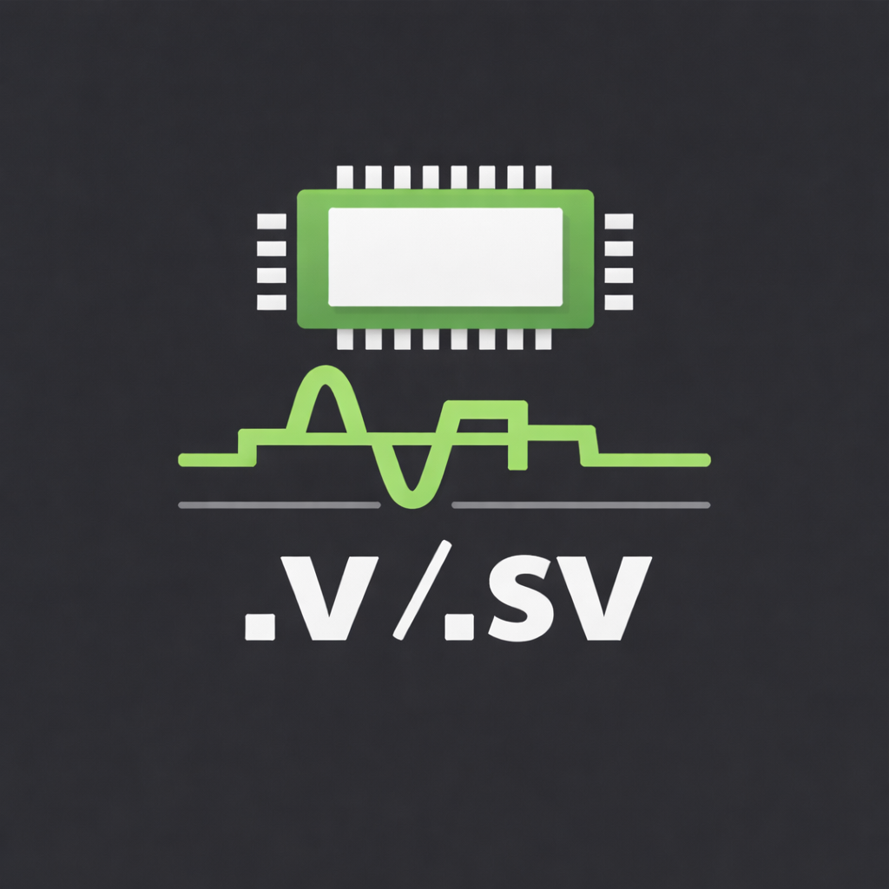
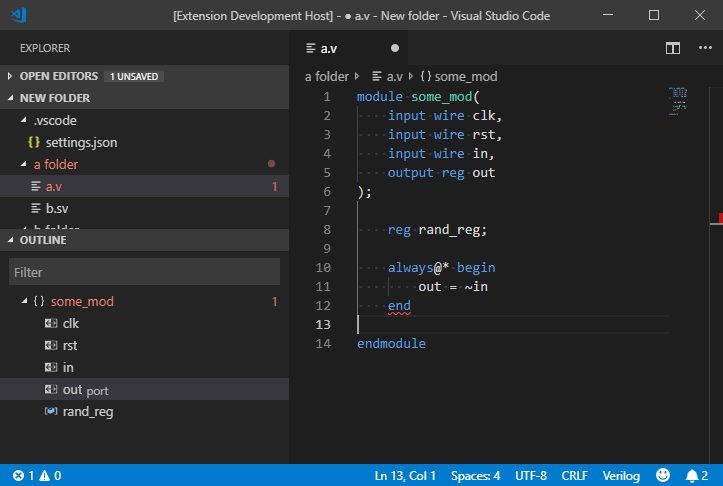

# HDL support for VS Code 

HDL support for VS Code with syntax highlighting, snippets, classic Ctags-backed editing features, linting, formatting, waveform viewing, inactive preprocessor highlighting, and optional external language servers.

[](https://www.bestpractices.dev/projects/10949)
[Ask DeepWiki](https://deepwiki.com/mshr-h/vscode-verilog-hdl-support)



## Installation

Install the extension from the [VS Code Marketplace](https://marketplace.visualstudio.com/items?itemName=mshr-h.VerilogHDL) or [Open VSX Registry](https://open-vsx.org/extension/mshr-h/veriloghdl).

## Features

- Syntax highlighting for Verilog, SystemVerilog, VHDL, Verilog-AMS, UCF, SDC, XDC, Tcl, UPF, and Verilog filelists.
- Verilog, SystemVerilog, and Verilog-AMS snippets.
- Inactive Verilog/SystemVerilog preprocessor region highlighting.
- Classic Ctags-backed completion, document symbols, hover, definition lookup, peek definition, and module instantiation.
- File linting with Icarus Verilog, ModelSim, Verilator, Vivado `xvlog`, Slang, or Verible Verilog Lint.
- Formatting with `verilog-format`, iStyle, or `verible-verilog-format`.
- VCD viewing with the embedded [Fliplot](https://github.com/raczben/fliplot) viewer or optional [Vaporview](https://marketplace.visualstudio.com/items?itemName=lramseyer.vaporview).
- Optional external language servers: svls, veridian, HDL Checker, verible-verilog-ls, vhdl_ls, and tclsp.

The extension does not scan or index an HDL workspace automatically. Cross-file project intelligence is available only through an external language server or another dedicated extension.

## Commands

- **Verilog: Instantiate Module** — choose a module from the workspace and insert an instantiation using the classic Ctags flow.
- **Verilog: Rerun lint tool** — rerun the configured linter on the active Verilog/SystemVerilog file.
- **Verilog: Doctor** — inspect configured Ctags, linter, formatter, language-server, WSL, include-path, and configuration-file setup without modifying HDL files.
- **Verilog: Open Waveform** — open a VCD with the configured viewer.
- **Verilog: Open Fliplot Waveform Viewer** — open the embedded viewer directly.

## Ctags Integration

The built-in editing providers use [Universal Ctags](https://github.com/universal-ctags/ctags), which supports SystemVerilog better than older Ctags implementations.

Configure Ctags with:

```json
{
    "verilog.ctags.enabled": true,
    "verilog.ctags.path": "ctags"
}
```

The built-in Ctags integration generates tags in memory for the currently opened file. It does not create a workspace-wide tag database or automatically index other HDL files. An independent extension such as [Ctags Companion](https://github.com/gediminasz/ctags-companion) can provide broader workspace or external-library lookup.

Universal Ctags installation options:

- Windows: [ctags-win32 builds](https://github.com/universal-ctags/ctags-win32)
- Linux: [Universal Ctags build instructions](https://github.com/universal-ctags/ctags/blob/master/docs/autotools.rst)
- macOS: [Homebrew Universal Ctags](https://github.com/universal-ctags/homebrew-universal-ctags)

## Linting

Set `verilog.linting.linter` to one of:

- `iverilog`
- `modelsim`
- `verilator`
- `xvlog`
- `slang`
- `verible-verilog-lint`
- `none`

The selected executable must be on `PATH`, or its installation directory can be set with `verilog.linting.path`. Automatic linting uses the classic behavior: configured linters run when Verilog/SystemVerilog documents are opened and saved. The command **Verilog: Rerun lint tool** runs it manually.

Include directories configured through each linter's `includePath` setting can be absolute or workspace-relative. Custom arguments are split into an argument array and are not executed as a shell command.

### Vivado xvlog working directory

Vivado `xvlog` may create `xsim.dir`, `xvlog.pb`, and related compiler files in its current working directory. Each lint run now uses its own extension-managed temporary directory as the process working directory. The source file, configured include directories, and relative `-f`/project-file arguments are resolved before the process starts. The directory is removed after success, failure, or cancellation.

The extension does not inject a `-work` option. In particular, it does not use the invalid `-work work=<path>` form that prevented diagnostics on some Windows/Vivado versions. Custom xvlog arguments remain supported.

On Windows, the shared tool runner resolves `xvlog.exe`, `xvlog.cmd`, or `xvlog.bat` and passes arguments without building an unsafe shell command string.

## Formatting

Use VS Code's **Format Document** command after choosing a formatter under `verilog.formatting`.

- Verilog: `verilog-format`, iStyle, or `verible-verilog-format`
- SystemVerilog: `verible-verilog-format`

Range formatting is not supported. Formatter paths and arguments are configured separately. The `verilog-format` settings path supports `~` and `${env:VAR}` expansion.

## Waveform Viewing

Set `verilog.waveform.viewer` to:

- `auto` — use Vaporview when installed, otherwise Fliplot
- `vaporview`
- `fliplot`

Use **Verilog: Open Waveform** for the configured behavior or **Verilog: Open Fliplot Waveform Viewer** to open the bundled viewer directly.

## Inactive Preprocessor Highlighting

The lightweight editor scanner highlights inactive branches controlled by `` `ifdef``, `` `ifndef``, `` `elsif``, `` `else``, and `` `endif``.

```json
{
    "verilog.preprocessor.defines": ["SIMULATION", "USE_VENDOR_IP"],
    "verilog.preprocessor.inactiveCode.enabled": true,
    "verilog.preprocessor.inactiveCode.opacity": 0.45
}
```

This scanner uses macros defined in the current document plus `verilog.preprocessor.defines`. It does not resolve include files, filelists, or simulator arguments.

## Optional Language Servers

External language servers are disabled by default and configured under `verilog.languageServer`. Multiple servers can be enabled, although overlapping providers may produce duplicate results.

| Language server | Verilog | SystemVerilog | VHDL / Tcl-family |
| --- | :---: | :---: | :---: |
| [svls](https://github.com/dalance/svls) | — | yes | — |
| [veridian](https://github.com/vivekmalneedi/veridian) | — | yes | — |
| [HDL Checker](https://github.com/suoto/hdl_checker) | yes | yes | VHDL |
| [verible-verilog-ls](https://github.com/chipsalliance/verible) | yes | yes | — |
| [vhdl_ls](https://github.com/VHDL-LS/rust_hdl) | — | — | VHDL |
| [tclsp](https://github.com/nmoroze/tclint) | — | — | Tcl, SDC, XDC, UPF |

Use **Verilog: Doctor** to check enabled server executables, arguments, and configuration paths.

## Migration from v1.26–v1.28

Stable v1.29 returns to the classic v1.25 architecture. The extension-owned project model, semantic index, hierarchy, project diagnostics, compile-unit linting, HDL Explorer, and managed slang-server runtime are no longer part of the stable extension.

Existing `.slang/server.json` files are not read, created, modified, or deleted. Obsolete settings may remain in user or workspace settings, but the extension no longer consumes them. Review VS Code settings and remove keys under the former project, semantic-diagnostics, hierarchy, HDL Explorer, and managed slang-server namespaces when convenient.

Ctags-backed editing features and the optional external language-server integrations are available again.

## Troubleshooting

1. Run **Verilog: Doctor** and inspect the `Verilog Doctor` output channel.
2. Confirm the selected Ctags, linter, formatter, or language-server executable is available on the extension host's `PATH`, or configure its path explicitly.
3. For multi-root workspaces, place relative include/config paths under the workspace folder containing the active file.
4. If Ctags navigation cannot find another file, remember that the built-in integration only tags the current document; use an external language server or Ctags workspace extension for cross-file lookup.
5. If xvlog fails without a normal VRFC diagnostic, check the Verilog output log for its exit status and stderr summary. Temporary-directory cleanup failures are logged separately and do not hide diagnostics.
6. On Windows, restart VS Code after changing Vivado or Ctags environment variables so the extension host receives the updated `PATH`.

## Contributing and Licenses

See [CONTRIBUTING.md](./CONTRIBUTING.md) for development instructions and [THIRD_PARTY_NOTICES.md](./THIRD_PARTY_NOTICES.md) for bundled third-party notices.
